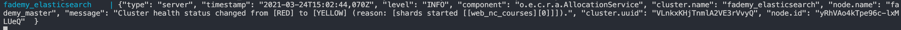

# Fademy

Tài liệu hướng dẫn cài đặt và sử dụng dự án Fademy

## Môi trường kiến nghị (được sử dụng khi phát triển dự án)

* MacOS 10.15.1
* Docker 3.0.4
* Node 14.15.1

## Hướng dẫn cài đặt dự án

0. Chuẩn bị

```
chmod +x 1.setup-app.local.sh
chmod +x 2.run-app.local.sh
chmod +x 3.run-migration.local.sh
chmod +x 4.remove-app.local.sh
```

```bash
sudo sysctl -w vm.max_map_count=262144
```

**1. Cài đặt Mysql và Elasticsearch**

```
./1.setup-app.local.sh
```

**Quan trọng:** đợi cho hiện chạy thành công thì mới thực hiện lệnh tiếp theo

* Ví dụ chạy thành công



**2. Cài đặt project**

* Mở một termial khác
* Tiếp theo chạy lệnh sau

```
./2.run-app.local.sh
```

**Quan trọng:** đợi cho lệnh hiện tại chạy thành công thì mới thực hiện lệnh tiếp theo

* Ví dụ chạy thành công


**3. Insert dữ liệu vào Mysql và Elasticsearch**

* Mở một termial khác
* Tiếp theo chạy lệnh sau

```
./3.run-migration.local.sh
```

## Hướng dẫn sử dựng

Tài khoản admin:

* username: **admin**
* password: **123456789**

Tài khoản teacher:

* username: **teacher1**
* password: **123456789**

Tài khoản student:

* username: **student1**
* password: **123456789**

## Gỡ bỏ dự án

* Tắt hết các terminal liên quan đến dự án

```
./4.remove-app.local.sh
```